<p align="center">
  
</p>

# goal-dual

<p align="center">
  <strong>Claude Code に、Claude orchestration + Codex work loop を追加するプラグイン。</strong>
</p>

<p align="center">
  <a href="#インストール">Install</a> ·
  <a href="#クイックスタート">Quick Start</a> ·
  <a href="#ワークフロー">Workflow</a> ·
  <a href="#コマンド">Commands</a> ·
  <a href="#安全上の注意">Safety</a> ·
  <a href="README.md">English</a>
</p>

goal-dual は、Claude Code 上で OpenAI Codex プラグインを反復開発ワークフローに組み込むためのプラグインです。

Claude がゴール整理・進行管理・最終判断を担当し、Codex がコード調査・実装・一次評価を担当します。テスト結果を見ながら小さくループを回し、ゴール達成まで進めます。

## 何がうれしいか

| 課題 | goal-dual がすること |
|---|---|
| ゴールをうまく書けない | `/goal-dual:plan` で曖昧な依頼を実装可能な plan に整理 |
| 実装を一度で終わらせるのが難しい | Codex Work と評価を iteration として繰り返す |
| Claude だけで実装すると重い | コード調査・実装・一次評価を Codex に委譲 |
| テスト結果を見ながら直したい | `npm test` / `pytest` などを実行して次アクションを判断 |
| 作業履歴を残したい | 完了後に PR 説明文と実行履歴を生成 |

## インストール

推奨は Claude Code Marketplace 経由です。

```text
/install codex@openai-codex
/plugin marketplace add khr8959/goal-dual-plugin
/plugin install goal-dual@goal-dual
/reload-plugins
```

Marketplace 経由の場合、作業中のプロジェクト内に `goal-dual-plugin/` を clone する必要はありません。Claude Code がプラグインをローカルキャッシュへ配置します。

## クイックスタート

具体的なゴールが決まっている場合:

```text
/goal-dual:run ユーザー認証機能を追加する。JWT でアクセストークンを発行し、/api/me エンドポイントを保護する。
```

ゴールの書き方に迷う場合:

```text
/goal-dual:plan ログイン後にユーザー情報を表示できるようにしたい
/goal-dual:run
```

`/goal-dual:plan` は実装を開始せず、`.goal-dual/plan/` に計画・完了条件・変更範囲・確認事項を作ります。計画が ready になった後、引数なしで `/goal-dual:run` を実行すると、その plan を読んで実装を開始します。

## ワークフロー

`/goal-dual:run` は、次の流れを繰り返します。

1. Claude がゴール、完了条件、変更範囲を整理する
2. goal-dual が OpenAI Codex プラグインへ作業を依頼する
3. Codex がコードを調査し、必要な変更を実装する
4. shell がテストコマンドを実行する
5. Codex が一次評価し、Claude が続行・完了・停止を判断する

完了条件を満たしていない場合は次の iteration に進みます。ゴールと既存テストが矛盾する場合、または判断が難しい場合は、人間の確認が必要な状態で停止します。

## コマンド

| コマンド | 用途 |
|---|---|
| `/goal-dual:run <ゴール>` | ゴール達成まで反復実装する |
| `/goal-dual:run` | ready な plan を読んで実装を開始する |
| `/goal-dual:plan <相談内容>` | 曖昧な依頼を実装用 plan に整理する |
| `/goal-dual:review` | 現在の変更をレビューする |
| `/goal-dual:history` | 過去の goal-dual 実行履歴を表示する |
| `/goal-dual:route <依頼>` | goal-dual を使うべきか判断する |

## 役割分担

| 役割 | 担当 |
|---|---|
| ゴール整理・進行管理・最終判断 | Claude |
| コード調査・実装・一次評価 | OpenAI Codex plugin |
| テスト実行 | shell |

## 生成されるファイル

goal-dual は、実行中のプロジェクトに以下の作業ディレクトリを作成します。

| パス | 内容 |
|---|---|
| `.goal-dual/` | 現在の実行状態、ログ、評価結果 |
| `.goal-dual/plan/` | `/goal-dual:plan` で作成した plan |
| `.goal-dual-archive/` | 完了後にアーカイブされた実行履歴 |

これらは作業用ファイルです。通常は Git に commit しません。

## 要件

- Claude Code
- Node.js 18 以上
- `jq`
- `git`
- [codex CLI](https://github.com/openai/codex)
- Claude Code の `codex@openai-codex` プラグイン

## 安全上の注意

- goal-dual はコードを変更し、必要に応じて commit を作成します。
- 実行前に作業ツリーが dirty な場合は停止します。
- テストコマンドは許可済みの代表的なコマンドに制限されています。
- `.goal-dual/` と `.goal-dual-archive/` は実行ログを含むため、公開リポジトリへ commit しないでください。
- API key、token、秘密鍵などを issue、README、plan、goal に書かないでください。

## 環境変数

| 変数名 | 説明 | デフォルト |
|---|---|---|
| `GOAL_DUAL_REVIEW_LEVEL` | コードレビューの厳格度。`strict` / `standard` / `relaxed` | `standard` |
| `GOAL_DUAL_STAGNATION_THRESHOLD` | 同じ verdict が何回続いたら停止するか | `3` |
| `GOAL_DUAL_WIP_COMMITS` | 未完了 iteration の WIP commit を作るか。`1` / `0` | `1` |

## 手動インストール

手動インストールは、プラグイン自体を開発・検証する場合だけ使ってください。

```bash
cd ~/Documents/GitHub
git clone https://github.com/khr8959/goal-dual-plugin.git
cd goal-dual-plugin
bash install.sh
```

`git clone` は、まだ `goal-dual-plugin` ディレクトリの中にいない場所で実行してください。既存の `goal-dual-plugin` ディレクトリ内で再度 clone すると、`goal-dual-plugin/goal-dual-plugin/` という入れ子コピーが作られます。

## アンインストール

Marketplace 経由でインストールした場合:

```text
/plugin uninstall goal-dual
```

手動インストールした場合:

```bash
rm ~/.claude/commands/goal-dual.md
rm ~/.claude/commands/goal-dual-plan.md
rm ~/.claude/commands/goal-dual-history.md
rm ~/.claude/commands/goal-dual-review.md
rm ~/.claude/commands/goal-dual-route.md
rm ~/.claude/agents/goal-dual-*.md
rm -rf ~/.claude/goal-dual/
```

## ファイル構成

```text
goal-dual-plugin/
├── .claude-plugin/
│   └── marketplace.json
├── assets/
│   └── goal-dual-flow.svg
├── plugins/
│   └── goal-dual/
│       ├── .claude-plugin/
│       │   └── plugin.json
│       ├── agents/
│       ├── commands/
│       └── scripts/
├── install.sh
├── package.json
└── README.md
```

## ライセンス

MIT
