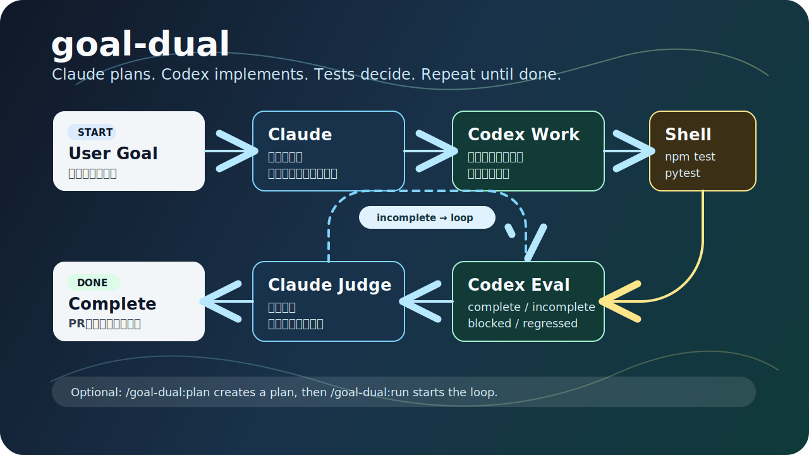

<p align="center">
  
</p>

# goal-dual

<p align="center">
  <strong>A Claude Code plugin that adds a Claude orchestration + Codex work loop — iterating until your goal is done.</strong>
</p>

<p align="center">
  <a href="#installation">Install</a> ·
  <a href="#quick-start">Quick Start</a> ·
  <a href="#workflow">Workflow</a> ·
  <a href="#commands">Commands</a> ·
  <a href="#safety">Safety</a> ·
  <a href="README.ja.md">日本語</a>
</p>

**goal-dual** is a Claude Code plugin that integrates the OpenAI Codex plugin into an iterative development loop.

Claude handles goal clarification, orchestration, and final judgment. Codex handles code investigation, implementation, and initial evaluation. The loop runs — checking test results each iteration — until your goal is met.

## Why goal-dual?

| Pain point | What goal-dual does |
|---|---|
| Hard to write a precise goal | `/goal-dual:plan` turns a vague request into an actionable plan |
| One shot rarely gets it right | Codex work + evaluation runs as repeated iterations |
| Claude alone is heavy on context | Code investigation, implementation, and first-pass evaluation are delegated to Codex |
| Want to fix based on test output | Runs `npm test` / `pytest` etc. and decides next action from results |
| Want to keep a work log | Generates a PR description and execution history on completion |

## Installation

Recommended: install via the Claude Code Marketplace.

```text
/install codex@openai-codex
/plugin marketplace add khr8959/goal-dual-plugin
/plugin install goal-dual@goal-dual
/reload-plugins
```

With Marketplace install, you do **not** need to clone `goal-dual-plugin/` into your project. Claude Code places the plugin in its local cache automatically.

## Quick Start

When you have a clear goal:

```text
/goal-dual:run Add user authentication. Issue a JWT access token and protect the /api/me endpoint.
```

When you're not sure how to phrase the goal:

```text
/goal-dual:plan I want to show user info after login
/goal-dual:run
```

`/goal-dual:plan` does **not** start implementation — it writes a plan, completion criteria, scope, and open questions to `.goal-dual/plan/`. Once the plan is `ready`, run `/goal-dual:run` with no arguments to start implementing from that plan.

## Workflow

`/goal-dual:run` repeats the following loop:

1. Claude clarifies the goal, completion criteria, and scope of changes
2. goal-dual delegates work to the OpenAI Codex plugin
3. Codex investigates the codebase and implements the required changes
4. The shell runs the test command
5. Codex performs an initial evaluation; Claude decides whether to continue, complete, or stop

If the completion criteria are not met, the next iteration begins. If the goal and existing tests conflict, or a judgment call is too difficult, the loop stops and waits for human input.

## Commands

| Command | Purpose |
|---|---|
| `/goal-dual:run <goal>` | Iterate until the goal is achieved |
| `/goal-dual:run` | Start implementing from a ready plan |
| `/goal-dual:plan <request>` | Turn a vague request into an implementation plan |
| `/goal-dual:review` | Review the current changes |
| `/goal-dual:history` | Show past goal-dual execution history |
| `/goal-dual:route <request>` | Decide whether goal-dual is the right tool |

## Responsibilities

| Role | Handled by |
|---|---|
| Goal clarification, orchestration, final judgment | Claude |
| Code investigation, implementation, initial evaluation | OpenAI Codex plugin |
| Test execution | shell |

## Generated Files

goal-dual creates the following working directories in your project:

| Path | Contents |
|---|---|
| `.goal-dual/` | Current run state, logs, evaluation results |
| `.goal-dual/plan/` | Plans created by `/goal-dual:plan` |
| `.goal-dual-archive/` | Execution history archived after completion |

These are working files. Do not commit them to Git.

## Requirements

- Claude Code
- Node.js 18+
- `jq`
- `git`
- [Codex CLI](https://github.com/openai/codex)
- The `codex@openai-codex` Claude Code plugin

## Safety

- goal-dual modifies code and may create commits as needed.
- If the working tree is dirty before a run, goal-dual stops immediately.
- Test commands are restricted to a known-safe allowlist.
- Do not commit `.goal-dual/` or `.goal-dual-archive/` to public repositories — they contain execution logs.
- Do not include API keys, tokens, or secrets in issues, README files, plans, or goals.

## Environment Variables

| Variable | Description | Default |
|---|---|---|
| `GOAL_DUAL_REVIEW_LEVEL` | Code review strictness: `strict` / `standard` / `relaxed` | `standard` |
| `GOAL_DUAL_STAGNATION_THRESHOLD` | How many identical verdicts in a row before stopping | `3` |
| `GOAL_DUAL_WIP_COMMITS` | Whether to create WIP commits for incomplete iterations: `1` / `0` | `1` |

## Manual Installation

Manual installation is only recommended when developing or testing the plugin itself.

```bash
cd ~/Documents/GitHub
git clone https://github.com/khr8959/goal-dual-plugin.git
cd goal-dual-plugin
bash install.sh
```

Run `git clone` from **outside** the `goal-dual-plugin` directory. Cloning again from inside will create a nested `goal-dual-plugin/goal-dual-plugin/` copy.

## Uninstall

If installed via Marketplace:

```text
/plugin uninstall goal-dual
```

If installed manually:

```bash
rm ~/.claude/commands/goal-dual.md
rm ~/.claude/commands/goal-dual-plan.md
rm ~/.claude/commands/goal-dual-history.md
rm ~/.claude/commands/goal-dual-review.md
rm ~/.claude/commands/goal-dual-route.md
rm ~/.claude/agents/goal-dual-*.md
rm -rf ~/.claude/goal-dual/
```

## File Structure

```text
goal-dual-plugin/
├── .claude-plugin/
│   └── marketplace.json
├── assets/
│   └── goal-dual-flow.svg
├── plugins/
│   └── goal-dual/
│       ├── .claude-plugin/
│       │   └── plugin.json
│       ├── agents/
│       ├── commands/
│       └── scripts/
├── install.sh
├── package.json
└── README.md
```

## License

MIT
